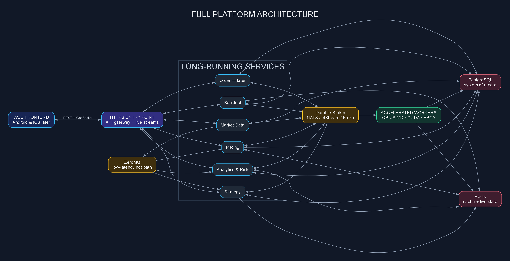
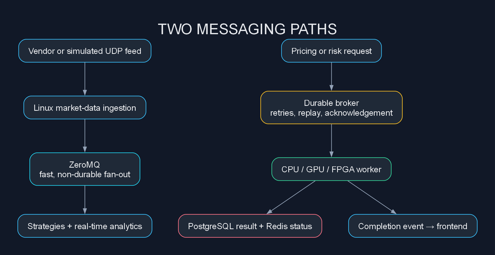
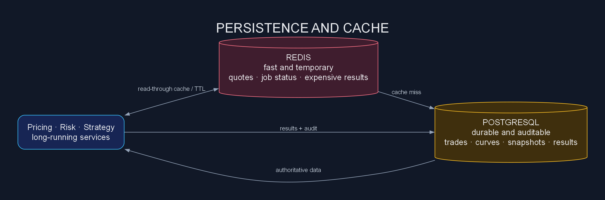
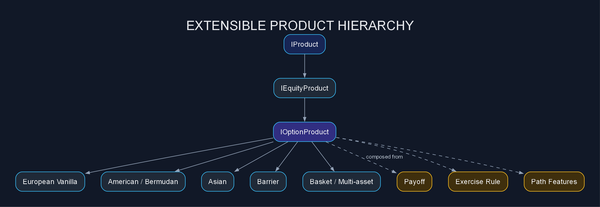
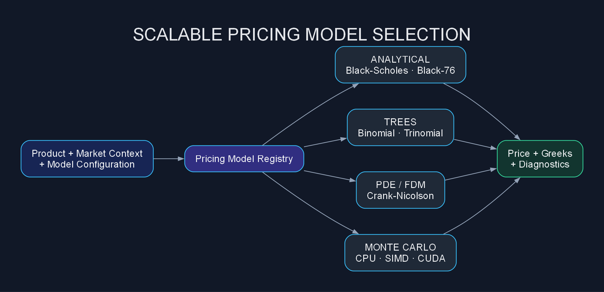
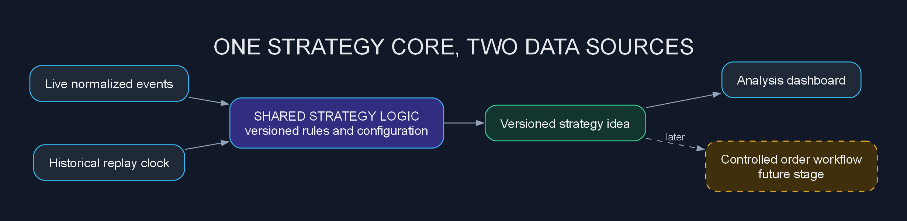
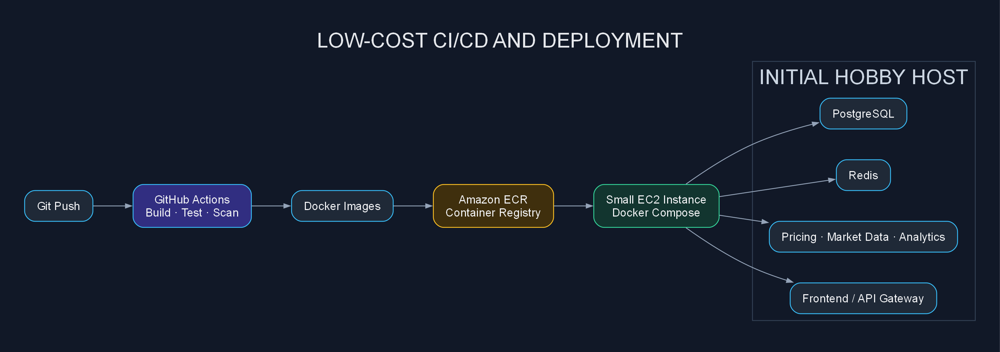

# Architecture Before Algorithms: Building a Scalable Derivatives Platform on a Hobby Budget

## Chapter 2 of Ultra-Low Latency: Building Modern HFT Trading Systems

It is tempting to start a derivatives platform with a pricing formula, a market-data API and a screen showing the result. That is enough for a demonstration, but not for a system that can grow.

We want to support multiple products, pricing models, numerical methods, strategies, backtests and, eventually, controlled order execution. We also want a web frontend today and a path to Android and iOS later. At the same time, this is still a hobby project, so the infrastructure must stay inexpensive until real workload justifies something larger.

That leads to a simple principle:

> Products describe contracts. Models describe valuation. Services coordinate work. Infrastructure moves and stores data.

The project is available in the [AutomatedTrading GitHub repository](https://github.com/yogeshnema/AutomatedTrading).

---

## What we are building

The platform is intended to support several workflows:

- See whether market data is current and healthy.
- Price individual or packaged derivative trades.
- Compare analytical and numerical pricing methods.
- Calculate Greeks, scenarios and portfolio risk.
- Design strategies and generate trading ideas.
- Run reproducible historical backtests.
- Add controlled order execution later.
- Expose the same backend capabilities to web, Android and iOS clients.

These workflows have very different performance characteristics. A Black-Scholes calculation can return immediately. A large Monte Carlo simulation may require an asynchronous GPU worker. A backtest may process years of data. Market data is continuous and latency-sensitive.

Putting everything into one executable would make the system difficult to scale and change. Our current direction is therefore a set of long-running services with clear interfaces.

---

## The full architecture

*Chart 1: The frontend uses stable HTTP and streaming interfaces, while internal services can use the transport and hardware best suited to their workload.*



The editable design is in the repository as a [draw.io architecture diagram](https://github.com/yogeshnema/AutomatedTrading/blob/option-pricing/architecture/full-system-microservices-architecture.drawio).

The frontend does not need to know which service instance, database query or processor produced a result. It talks to a stable HTTPS boundary. Live status updates can arrive through WebSockets or Server-Sent Events.

That boundary also makes mobile support practical. A future Android or iOS application can use the same authenticated APIs without understanding C++, PostgreSQL or ZeroMQ.

---

## One system, two messaging paths

No single middleware is ideal for every message.

ZeroMQ remains useful for the internal low-latency path. It can distribute normalized market events to strategy, analytics and pricing consumers with relatively little overhead. It is suitable for the hot data plane, but PUB/SUB is not a permanent record: a disconnected subscriber may miss data.

Durable business work needs a different path. Pricing jobs, completed risk runs, generated strategy ideas and future order states require acknowledgements, retries and replay. For this we plan to evaluate NATS JetStream or Kafka.



This separation keeps high-rate market events away from durable business workflows while allowing important work to survive process restarts.

---

## PostgreSQL and Redis

PostgreSQL is our system of record. It stores instruments, trades, packages, configuration, economic data, curves, volatility surfaces, market snapshots, pricing runs, risk results and backtest parameters.

Redis serves a different purpose: fast, short-lived shared state. It can hold latest quotes, market refresh status, asynchronous job progress and expensive calculation results.



A cached price must be associated with its trade version, valuation time, market snapshot, model version and parameters. A fast stale answer is worse than a slightly slower correct one.

---

## Scaling products without rewriting the platform

An option is a contract. Black-Scholes, a tree, Monte Carlo and finite differences are ways to value that contract. They should not be fused into one class hierarchy.

Our product model composes several concepts:

- A payoff describes the cash-flow shape.
- An exercise rule describes when exercise is allowed.
- A path feature describes averaging, barriers or monitoring.
- Market references identify spot, curves and volatility inputs.
- Settlement rules describe how the result becomes a cash flow.



The current hierarchy is available in the [equity-product class diagram](https://github.com/yogeshnema/AutomatedTrading/blob/option-pricing/architecture/equity-products-class-hierarchy.drawio).

Adding an Asian or barrier option should primarily add its own features and validation. It should not require changes to every existing European option.

---

## Scaling pricing models and numerical methods

Pricing models sit behind a common interface. A model registry can select an implementation based on the product, requested method, accuracy requirement and available hardware.



Fast analytical calculations can remain synchronous. Large Monte Carlo, portfolio-risk and scenario calculations can become jobs handled by CPU or GPU workers.

The caller should not change when an implementation moves from scalar CPU code to SIMD or CUDA. That hardware choice belongs behind the pricing interface.

---

## Strategies and backtests as first-class services

A strategy should consume normalized market state and analytics, then produce a structured idea. It should not be hard-wired into the market-data downloader or future order engine.

A strategy idea can contain its strategy version, instruments, proposed package, direction, entry conditions, score, market context, expiry time and risk limits.

The live strategy engine and backtest engine should share the same decision logic wherever possible:



The difference is the clock and data source. Live mode consumes current events; backtest mode consumes an ordered historical replay. Recording the strategy version, input snapshot, assumptions and source commit makes the result reproducible.

---

## Low latency without expensive infrastructure everywhere

The browser, a historical backtest and an exchange-facing feed handler do not have the same latency requirements.

We separate the maintainable control plane—HTTP APIs, configuration, persistence and frontend workflows—from the latency-sensitive data plane.

The Linux hot path can progressively introduce:

- Preallocated memory and bounded queues
- CPU affinity and NUMA-aware allocation
- SIMD and AVX vectorization
- Batch calculations
- `io_uring` where asynchronous I/O benefits the workload
- AF_XDP or DPDK kernel bypass
- Simulated UDP feeds before a real direct feed
- CUDA for Monte Carlo and scenario calculations
- FPGA acceleration for selected stable workloads

This is a direction, not yet a performance claim. We need repeatable p50, p95, p99 and p99.9 measurements before calling any path ultra-low latency.

---

## Cheap infrastructure for a hobby project

The architecture may be capable of growing, but the first deployment should remain deliberately small.

Instead of beginning with EKS, a managed Kafka cluster and multiple databases, the practical first production-like environment can be one modest EC2 instance running Docker containers.



This approach gives us real CI/CD and container deployment without paying for orchestration before it is needed.

The initial cost-conscious stack is:

- GitHub Actions for build and test automation
- Docker images for consistent service packaging
- Amazon ECR for the container registry
- One small EC2 instance
- Docker Compose for service lifecycle and networking
- PostgreSQL and Redis containers initially, with persistent volumes and backups
- HTTPS through a small reverse proxy
- CloudWatch or lightweight open-source logging and metrics

As usage grows, the system can move in stages:

```text
Single EC2 host
→ separate database or managed PostgreSQL
→ separate compute workers
→ load-balanced service instances
→ ECS or EKS only when orchestration benefits justify the cost
```

The service boundaries remain useful even when several services share one machine. Microservices are deployment boundaries; they do not require an expensive cluster on day one.

---

## Coming next

The next architecture chapters will turn this design into a usable deployed platform.

### Git-based CI/CD

GitHub Actions will compile the Linux targets, run unit and integration tests, validate database migrations and build versioned Docker images.

### Docker and ECR

Each long-running service will receive its own container definition. Successful images will be tagged with a release version and Git commit, then pushed to Amazon ECR.

### EC2 deployment

The first deployment will pull approved images from ECR onto a small EC2 host. Docker Compose will start the frontend gateway, pricing service, supporting services, PostgreSQL and Redis.

### Mobile-ready frontend integration

The web frontend will use a stable Backend-for-Frontend API. Authentication, API versioning and live-update contracts will be designed so Android and iOS clients can reuse the same backend later.

The first frontend coverage should include:

- Overall service health
- Market-data freshness
- Trade lookup
- An ad hoc pricing form
- Model selection
- Price and Greek results
- Strategy ideas
- Backtest configuration and progress

---

## What still needs improvement

The architecture provides room to grow, but the next design work must improve three areas.

### Coverage

We need American and Bermudan exercise, Asian schedules, barriers, digital payoffs, basket products, additional curve construction, richer volatility surfaces and versioned market snapshots. Numerical validation and convergence tests must accompany every model.

### Latency

We need end-to-end tracing, queue-wait measurements, database timings, cache-hit rates, model execution timings and tail-latency distributions. Optimization should follow evidence rather than assumption.

### Frontend quality

We need a responsive frontend contract, authentication, clear stale-data warnings, asynchronous job status, meaningful pricing diagnostics and layouts that can later translate cleanly to mobile screens.

---

## Journey Roadmap

We have now moved the second box from empty to complete. A small tick for the roadmap, but quite a few architecture decisions behind it.

- ✅ **Part 1 — Why I’m Building a Quant Platform**
- ✅ **Part 2 — Architecture Before Algorithms**
- ⬜ Part 3 — Designing a Vendor-Agnostic Market Data Layer
- ⬜ Part 4 — Why Every Microsecond Matters
- ⬜ Part 5 — Building an Option Pricing Library in Modern C++
- ⬜ Part 6 — Pub/Sub, Protocol Buffers & Event-Driven Pricing
- ⬜ Part 7 — Lock-Free Queues and Memory Pools
- ⬜ Part 8 — Kernel Bypass and Zero-Copy Networking
- ⬜ Part 9 — Building a FIX Engine from Scratch
- ⬜ Part 10 — SIMD, CUDA and the Road to Nanoseconds
- ⬜ Part 11 — Market Microstructure: ITCH & OUCH
- ⬜ Part 12 — Building a Volatility Surface
- ⬜ Part 13 — Backtesting Without Lying to Yourself
- ⬜ Part 14 — Risk Engine, Greeks & Portfolio Analytics
- ⬜ Part 15 — Where AI Fits (and Doesn’t) in Quant Trading

Next comes Part 3: making market data vendor-agnostic, because a trading platform should not develop an identity crisis every time its data provider changes.

---

## Closing thought

That is where Part 2 leaves us: not with a finished platform, but with a clearer picture of what we want to build and a sensible place to begin.

This is still a hobby project, and I expect the design to change as the code meets real data, real workloads and—inevitably—real bugs. That is part of the reason I am sharing the journey rather than waiting for everything to look polished. Sometimes the interesting bit is not the final answer; it is discovering why the first three answers were wrong.

If you are building something similar, work in trading technology, or simply enjoy C++, quantitative finance and systems design, I would love to hear how you would approach it. Challenge an assumption, suggest a product or pricing method, point out a missing failure case, or tell me which part you would like to see explored next.

The project is open on [GitHub](https://github.com/yogeshnema/AutomatedTrading), so feel free to browse the code, open an issue, suggest an improvement or contribute a pull request. Beginners are welcome too—you do not need a rack of servers or a PhD in stochastic calculus to join the conversation.

Next, we move to Part 3 and make the market-data layer vendor-agnostic. Until then, comments, questions and constructive disagreements are all very welcome. Let us build this one piece—and probably a few debugging sessions—at a time.
